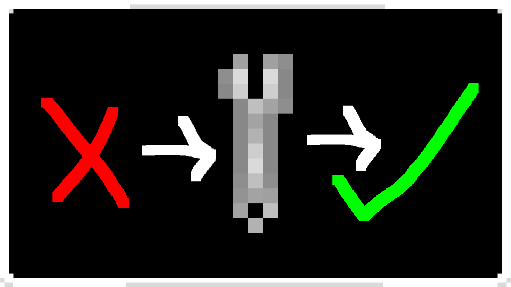

# CUModFixer

[中文指南](README_ZH.md)

[GitHub](https://github.com/CNCUMC/CUModFixer) | [NexusMods](https://www.nexusmods.com/scavprototype/mods/424)

_A BepInEx plugin for [Casualties Unknown](https://store.steampowered.com/app/4576490/) that fixes compatibility issues with third-party mods._

## Overview

**CUMod Fixer** is a compatibility patch plugin that resolves conflicts between [Casualties Unknown](https://store.steampowered.com/app/4576490/), [KrokoshaCasualtiesMP](https://www.nexusmods.com/scavprototype/mods/67) (multiplayer mod), and third-party mods like [New Firearms](https://www.nexusmods.com/scavprototype/mods/122) and [New Clothing](https://www.nexusmods.com/scavprototype/mods/122).

## Fix

### New Firearms
- Prevents `RshGun.MpScareCheck()` from throwing exceptions when `KrokoshaScavMultiGameObjectNetworkTracker` is missing on the item.
- Prevents `RshGun.IsOnBack()` from throwing a `NullReferenceException` when `NetPlayer.GetNetPlayerFromBody(body)` returns `null` during world generation.
- Prevents `PlayerCameraPatch1.HandleLegacyGunUi()` from throwing a `NullReferenceException` when `PlayerCamera.body` is `null` during world generation.
- Suppresses repeated "[NewFirearms] Can not add stun collider to spider" log warnings (only the first occurrence is logged).

### New Clothing
- Prevents `RshClothing.Update()` from throwing a `NullReferenceException` when `this.it` is `null`.

### KrokoshaCasualtiesMP
- Prevents `KrokoshaGunScriptTrackerComponent.Update()` from throwing a `NullReferenceException` when `PlayerCamera.main.body` is `null`.

## Requirements

- [BepInEx 5.x](https://github.com/BepInEx/BepInEx)

## Installation

1. Install BepInEx 5.x for Casualties Unknown.
2. Download the latest `CUModFixer.dll` from [Releases](https://github.com/CNCUMC/CUModFixer/releases).
3. Place `CUModFixer.dll` into `BepInEx/plugins/CUModFixer`.

## Project Structure

```
CUModFixer/
├── Plugin.cs                     # Entry point
├── Fixers/
│   ├── NewFirearmsFix.cs         # NewFirearms patches
│   ├── NewClothingFix.cs         # NewClothing patches
│   └── KrokoshaCasualtiesMPFix.cs# KrokoshaCasualtiesMP patches
├── CHANGELOG.md / CHANGELOG_ZH.md
├── README.md / README_ZH.md
└── LICENSE.md
```

## License

[LGPL v3](LICENSE.md)
